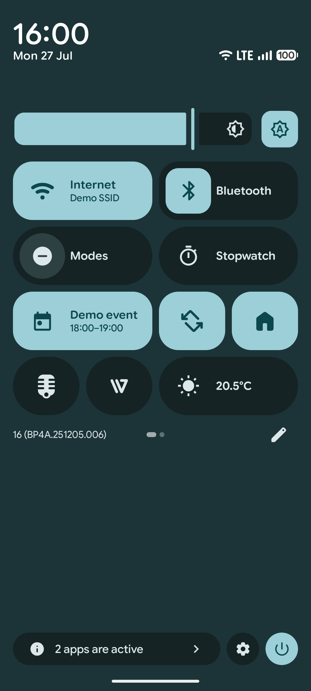
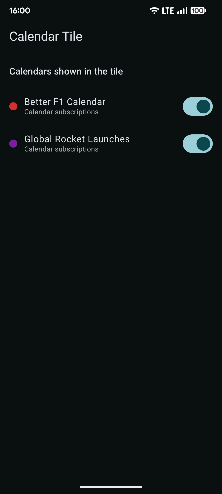

# Calendar Tile

An Android Quick Settings tile that shows your next upcoming calendar event, without opening an app.

[](https://github.com/agroqirax/calendarTile/releases/latest)
[](https://apps.obtainium.imranr.dev/redirect.html?r=obtainium://add/https://github.com/agroqirax/calendartile)

## Features

- **Quick Settings tile** — pull down the notification shade to see your next event's title and time.
- **Tap to open** — tapping the tile opens that event directly in your default calendar app (or the calendar app at "now" if no event is scheduled).
- **7-day lookahead** — surfaces the soonest event within the next week, preferring events happening right now over future ones.
- **Smart filtering** — automatically skips declined and cancelled events.
- **Per-calendar toggles** — the app screen lists every calendar on the device (across all accounts) with a switch to include/exclude it from the tile.
- **Choosable tile icon** — a plain calendar, the next event’s date, or an icon matching the event.
- **Custom icon mappings** — map your own keywords or regex to any of the icons.
- **Require unlock** — optionally hide your next event's details until the phone is unlocked.
- **Localized** — available in English, Dutch, German, French, Spanish, Italian, and Portuguese.

## Screenshots

<div display=flex flex-direction=row>
    
    
</div>

## Setup

1. Install the app and open it once to grant calendar access.
2. Add the **Calendar Tile** tile to your Quick Settings panel (usually via the pencil/edit icon in the notification shade).
3. Optionally, uncheck any calendars you don't want reflected in the tile.

## Requirements

- Android 7.0 (API 24) or later.
- Quick Settings tiles require Android 7.0+; per-tile subtitles (shown alongside the event title) require Android 10 (API 29)+.

## Privacy

Calendar Tile only reads calendar data on your device to build the tile. Nothing is uploaded or shared.

## Building

This is a standard Gradle-based Android project.

```bash
./gradlew assembleDebug
```

Open the project in Android Studio to build, run, or debug on a device/emulator.

## License

GPL-3.0. See [LICENSE](LICENSE).
